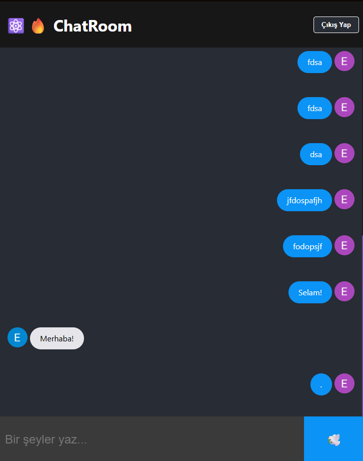
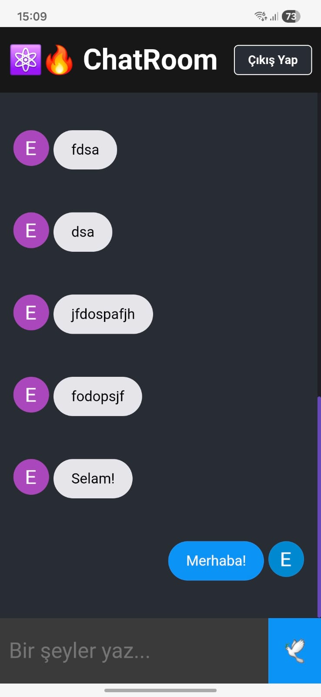

# ⚛️🔥 ChatRoom - Real-time Messaging App

A modern, real-time chat application built with **React** and **Firebase**. Users can sign in with their Google accounts and chat instantly with others in a shared room.

## 🚀 Features

- **⚛️ React & Vite:** Blazing fast performance and modern component structure.
- **🔥 Firebase Auth:** Secure and easy login via Google Sign-In.
- **📡 Firestore Real-time Database:** Messages sync instantly across all devices.
- **🎨 Responsive UI:** Dark mode design that looks great on mobile and desktop.
- **🛡️ Security:** Protected routes (SignIn required to view chat).

## 🛠️ Tech Stack

- **Frontend:** React.js, Vite
- **Backend as a Service:** Firebase (Authentication, Cloud Firestore)
- **Hosting:** Vercel
- **Styling:** CSS3 (Custom Dark Theme)

## 📸 Screenshots




## 📦 How to Run Locally

1.  **Clone the repository**

    ```bash
    git clone [https://github.com/1nkeeper/chat-room.git](https://github.com/1nkeeper/chat-room.git)
    cd chat-room
    ```

2.  **Install dependencies**

    ```bash
    npm install
    ```

3.  **Run the project**
    ```bash
    npm run dev
    ```

## 🔗 Live Demo

[Click here to view the live project!]()
